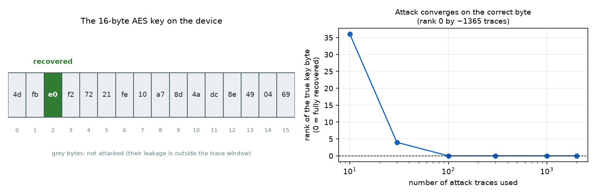

# Result: which AES key byte was recovered

This project runs a **side-channel attack** on AES-128. A small chip encrypts data
with a fixed 16-byte secret key. While it encrypts, its electromagnetic emissions
are recorded as a *trace* (700 numbers per encryption). From many such traces a
neural network recovers **one byte** of the key.

## What the attacker has vs. what they recover

| Given to the attacker (inputs) | Recovered (output) |
|---|---|
| ~10,000 power traces, 700 numbers each | one key byte |
| the plaintext of each encryption (public) | |
| **not** the key | |

The target is **key byte #2** (bytes are numbered 0-15). ASCAD only protects
bytes 2-15, and byte 2 is the standard benchmark target; the recorded traces only
contain the leakage for that byte, so bytes 0-1 and 3-15 are not attacked here
(see the report, section 5.4).

## The key and the recovered byte

```
byte #:   0    1   [2]   3    4    5    6    7    8    9   10   11   12   13   14   15
key   :   4d   fb  [e0]  f2   72   21   fe   10   a7   8d   4a   dc   8e   49   04   69
                    ^^
                    recovered by the attack, and it matches the true value (0xE0 = 224)
```

- **Full key on the device:** `4d fb e0 f2 72 21 fe 10 a7 8d 4a dc 8e 49 04 69`
  (this is only known here because it is a public research dataset - a real attacker would not have it)
- **Byte recovered:** #2
- **True value:** `0xE0` (224)
- **Attack's answer:** `0xE0` - **correct**
- It takes about **1,360 attack traces** for the guess to lock onto `0xE0` and stay there.



## See it yourself

```bash
python -m src.demo
```

This prints the plain-language summary above and writes
[`results/demo_output.txt`](results/demo_output.txt) and
[`results/recovered_key.png`](results/recovered_key.png). It runs the real attack
if `data/raw/ASCAD.h5` and a trained model are present (see the main
[README](README.md) for the download and training commands); otherwise it reports
the result recorded in `results/m3_fullkey_fixed.json`.

The full method, every model, and all milestone results are in the
[report](report/ASCAD_replication_report.pdf) and the [README](README.md).
